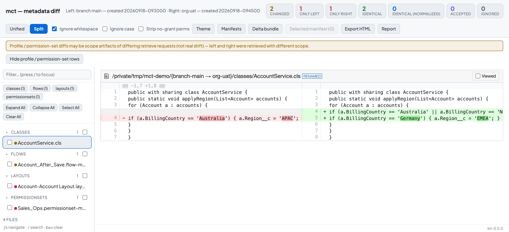

# Salesforce Metadata Compare

Compare Salesforce metadata across Git branches, authenticated orgs, and installed-package snapshots. Use the local web interface or the `mct` command to review drift, accept known differences, and export reports and deployment bundles.

The application does not deploy changes or push to Git remotes. Its optional `validate-deploy` command performs Salesforce check-only validation with `--dry-run`. See [the operation policy](NO_REMOTE_WRITE_POLICY.md).

## Requirements

- Python 3.10 or newer.
- Git.
- [Salesforce CLI](https://developer.salesforce.com/tools/salesforcecli), authenticated to the orgs you want to compare.
- Node.js for development and browser tests only.

CI targets macOS, Linux, and Windows. Local verification has been performed on macOS; check the GitHub Actions matrix for the published revision before relying on another platform.

## Install

Clone this repository somewhere **outside** your Salesforce DX project, then install it with [pipx](https://pipx.pypa.io/):

```sh
git clone https://github.com/billv5w/salesforce-metadata-compare.git
cd salesforce-metadata-compare
pipx install .
```

This gives you a global `mct` command. Use `pipx install --force .` after pulling updates. (The Python package is named `metadata-compare-tool`.)

## Quick start

**Web interface** (recommended for first use):

```sh
mct start
```

A browser page opens. Click the workspace button, enter a name, the path to your DX project, a branch, and an org alias, then save. Use **Retrieve** to take snapshots and **Compare** to open the diff viewer.

**Command line**, run from inside your DX project:

```sh
cd /path/to/dx-project
mct snapshot-all --branch main --org my-sandbox     # snapshot the branch and the org
mct list                                            # note the two snapshot IDs
mct ui --left <branch-snapshot-id> --right <org-snapshot-id>
```

`mct` uses the current directory as the DX project unless you pass `--repo-root PATH`. Commands that need a DX project stop with a clear message if `sfdx-project.json` is not found.



## The diff viewer

Choose the left/source and right/target snapshots and open the comparison. The diff page supports:

- Active, accepted, ignored, and stale-acceptance classifications.
- Metadata-type filters, file selection, and normalized XML/JSON diffs.
- Offline HTML reports and Markdown exports.
- Deployment and destructive-change manifests.
- ZIP bundles containing the selected components and their required source files.

Destructive manifest generation fails if Salesforce component names cannot be resolved accurately. Deploy-side resolution can fall back to a warning-marked heuristic; review warnings before using an export. Running any deployment commands from an exported bundle is a separate action performed by you.

## More command-line examples

```sh
# Snapshot a Git branch and retrieve the corresponding metadata from an org.
mct snapshot-org-from-source --branch main --org my-sandbox --wait-seconds 300

# Retrieve in both directions so org-only components are visible too.
mct snapshot-org-bidirectional --branch main --org my-sandbox

# Compare two saved snapshots, with a nonzero exit when active drift exists.
mct diff --left <source-snapshot-id> --right <target-snapshot-id> --fail-on-diff

# Run against a DX project in another folder.
mct --repo-root /path/to/dx-project list --json
```

Run `mct --help` or `mct <command> --help` for options. See the [comparison workflows](docs/metadata-compare-workflow.md) and [CI drift-monitoring recipes](docs/ci-drift-monitoring.md).

## State and migration

Snapshots, baselines, and comparison history live outside the installed package, keyed by DX project:

| Platform | Default data directory                       | Default configuration directory           |
| -------- | -------------------------------------------- | ----------------------------------------- |
| macOS    | `~/Library/Application Support/mct`          | `~/Library/Application Support/mct`       |
| Linux    | `$XDG_DATA_HOME/mct` or `~/.local/share/mct` | `$XDG_CONFIG_HOME/mct` or `~/.config/mct` |
| Windows  | `%LOCALAPPDATA%\mct`                         | `%LOCALAPPDATA%\mct`                      |

Set `MCT_DATA_DIR` and `MCT_CONFIG_DIR` to override these locations. Generated manifests are written under your DX project's `manifest/` directory. Saved workspaces live in the configuration directory.

For data from an older installation, run `mct migrate --legacy-root /path/to/old/.metadata-compare/snapshot-store`. To let the original checkout locate its own legacy store, run `python3 scripts/env-compare.py migrate` from that checkout instead. Migration copies and verifies data, preserves the originals, and reports existing destination conflicts. It does not overwrite an existing workspace registry.

## Comparison limits

- Comparison covers retrieved files. Missing or failed retrievals are not proof that a component was deleted from an org; inspect retrieval warnings and scope.
- Namespaced managed-package round-trips are only partially supported. Source-manifest generation can drop a namespace prefix, causing a follow-on retrieve to omit that component.
- Profile and PermissionSet contents depend on the request's metadata scope. Chunked retrievals record a scope warning for these types.
- XML above the normalizer size cap is compared byte-for-byte and flagged as `normalization_skipped`. Order-sensitive structures are preserved; supported unordered XML collections and JSON object keys are normalized.
- Accepting a difference is a comparison baseline decision, not a change to Salesforce metadata. Accepted entries can become stale when the compared content changes.
- A nonempty snapshot or passing small-sample comparison does not establish full-org completeness or large-org performance.

## Development

```sh
python3 -m venv .venv
# Activate .venv using your platform's shell, then:
python -m pip install -e ".[dev]"
npm ci
npx playwright install chromium

python -m pytest tests/unit tests/acceptance tests/review -q
python -m mypy scripts/ mct/ --ignore-missing-imports --strict-optional
npm run lint
npm run test:e2e
python scripts/verify_dist.py
```

The browser suite starts its local server automatically. Salesforce calls in the automated suites use synthetic fixtures or mocks; live-org verification is separate. See [testing and release validation](docs/testing.md).

```text
mct/                Python application and CLI
scripts/            Local servers, web assets, and distribution verifier
tests/unit/         Unit and integration-boundary tests
tests/acceptance/   Release acceptance tests
tests/review/       Additional regression tests
tests/e2e/          Playwright browser tests
docs/               User and maintainer documentation
.github/workflows/ Cross-platform CI
```

The UI assets are vendored under `scripts/ui/kit/`; no sibling repository is required to run or develop this project.

See [CONTRIBUTING.md](CONTRIBUTING.md) for the contribution workflow, [SECURITY.md](SECURITY.md) for reporting vulnerabilities, and [CHANGELOG.md](CHANGELOG.md) for release history.

## License

[MIT](LICENSE). Vendored dependency attribution is recorded in [scripts/ui/kit/vendor/README.md](scripts/ui/kit/vendor/README.md).
